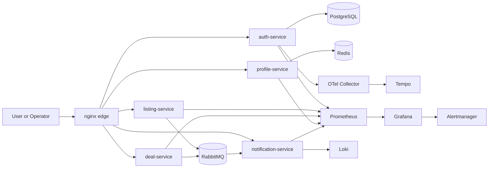

# RomanEstate Microservices DevOps Lab

Self-contained DevOps showcase that turns the RomanEstate domain into a compact microservice platform with:

- `nginx` edge routing
- five runnable domain services
- a real `nginx` upstream pool for the listing flow
- `PostgreSQL`, `Redis`, `RabbitMQ`, and `MinIO`
- `Prometheus`, `Grafana`, `Alertmanager`, `Loki`, `Tempo`, and `OpenTelemetry Collector`
- operational Python tooling for bootstrap, smoke, e2e, traffic generation, and backup/restore

## Portfolio Role

This repository is a supporting service-platform lab in the portfolio, not the primary platform flagship.

Its purpose is to answer a different question from the Kubernetes and IaC repositories:
"What does the platform actually support when real services, async flows, runtime dependencies, observability, and backup/restore are all in play?"

Use this repo after `enterprise-onprem-platform-lab` or `monitoring-stack-demo` when the conversation moves from platform capabilities to workload topology and operator experience.

## What This Repo Demonstrates

- extracting domain slices out of a monolith into runnable services
- routing traffic through one edge entrypoint
- edge security headers, request timeout, and rate-limit guardrails
- mixing sync API flows with RabbitMQ-backed async processing
- pairing metrics, logs, alerts, and traces in a Grafana-centric stack
- validating a local demo environment with reproducible scripts and CI

## Architecture



More design context lives in [docs/architecture.md](docs/architecture.md) and [docs/golden-path-service.md](docs/golden-path-service.md).

## Services in the Demo

| Service | Purpose | Key Runtime Dependency |
| --- | --- | --- |
| `auth-service` | login, JWT, `/api/auth/*`, `/api/whoami` | PostgreSQL |
| `listing-service` | listing creation and listing stats, served through a two-replica `nginx` pool | RabbitMQ publish |
| `deal-service` | viewing-request workflow | RabbitMQ publish |
| `profile-service` | favorites for demo users | Redis |
| `notification-service` | async consumer and event inbox | RabbitMQ consume |

## Quick Start

1. Start the full lab:

```powershell
python tools\bootstrap_env.py up --with-observability --build --smoke-after-up
```

2. Open the demo entrypoints:

- `http://127.0.0.1:8088`
- `http://127.0.0.1:8088/internal/`
- `http://127.0.0.1:3000`

3. Run the end-to-end flow:

```powershell
python tools\e2e_flow.py --base-url http://127.0.0.1:8088 --json
```

4. Run the lightweight load scenario:

```powershell
python tools\traffic_generator.py --base-url http://127.0.0.1:8088 --iterations 12 --concurrency 3 --json
```

5. Run PostgreSQL backup and restore verification:

```powershell
python tools\backup_postgres.py --output artifacts\realestate.sql
python tools\restore_postgres.py --input artifacts\realestate.sql --target-db realestate_restore_check
```

## Validation

The repo has a runnable CI path in [.github/workflows/devops-lab-ci.yml](.github/workflows/devops-lab-ci.yml) that exercises:

- `auth-service` unit tests
- Python service unit tests
- compose config validation
- repo-local hardening policy check
- full stack bootstrap
- smoke checks
- end-to-end service flow
- lightweight traffic generation
- PostgreSQL backup and restore verification

## Runbooks

- [Demo Runbook](runbooks/demo.md)
- [Backup and Restore Runbook](runbooks/backup-restore.md)
- [Workload Hardening Notes](docs/hardening.md)
- [Observability Stack Notes](infra/observability/README.md)

## Known Limitations

- the extracted services beyond `auth-service` are intentionally lightweight Python slices aimed at demo clarity rather than production-grade business depth
- the public and internal UI in full demo mode are static operator landing pages served by `nginx`
- tracing is currently proven on the auth path first, not on every cross-service hop; the local demo keeps `Tempo` on a pinned single-binary release for a stable compose workflow
- `MinIO` is part of the platform shell, but the first DoD slice does not yet exercise media flows end to end
- edge hardening is intentionally local-demo oriented; it is not a substitute for a production WAF or ingress controller policy

## Explicit Non-Goals

- migrate additional bounded contexts into richer service implementations
- add outbox/inbox guarantees for event publishing and consumption
- expand trace coverage beyond auth login to the full listing and deal flow
- add object-storage backup automation and incident simulation
- replace the static demo pages with dedicated public and internal frontend containers

These are deliberately outside the current DoD. This repo is finished as a supporting service-platform lab, not as a full product rewrite.
